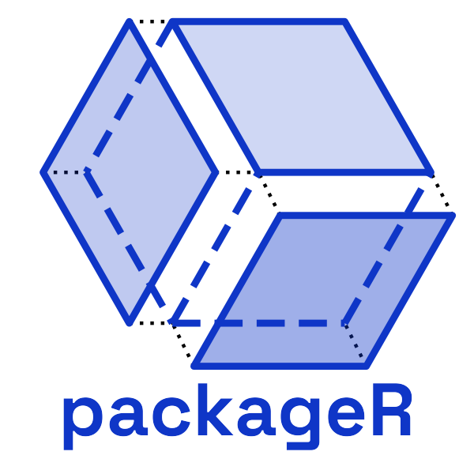
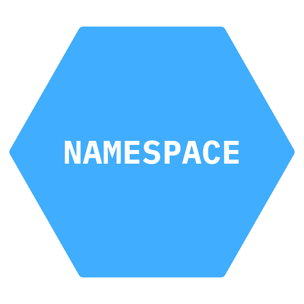
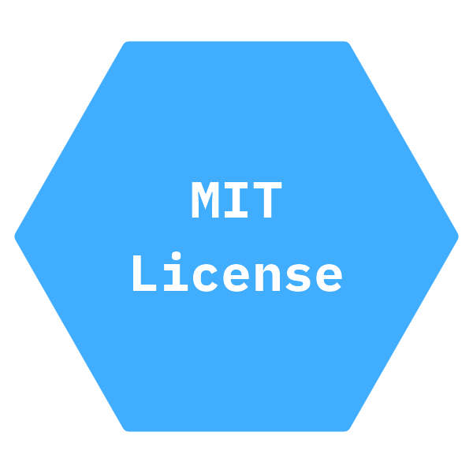
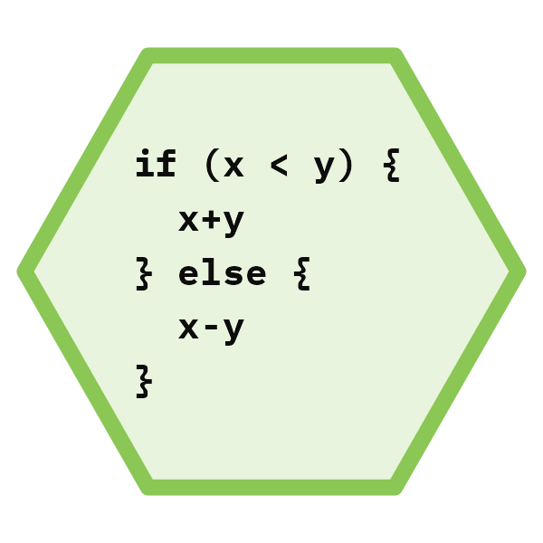
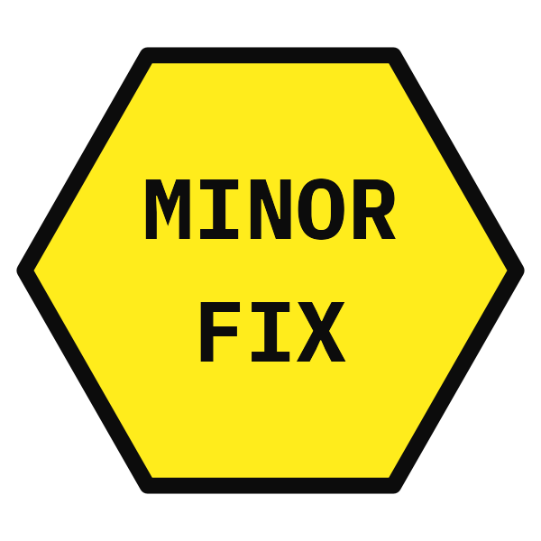
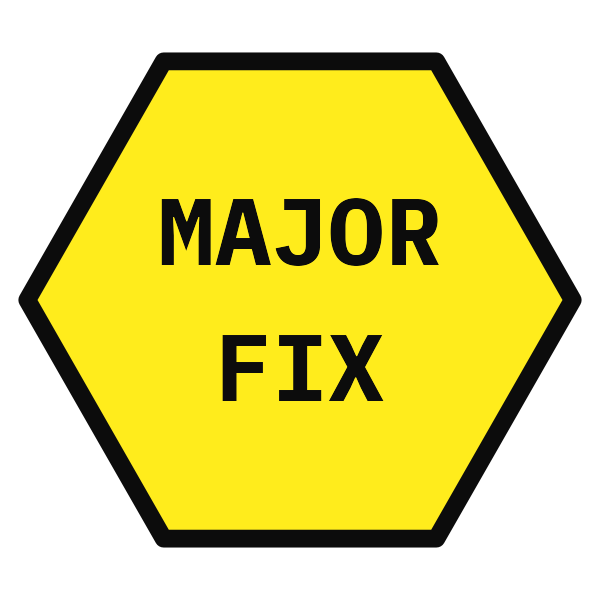
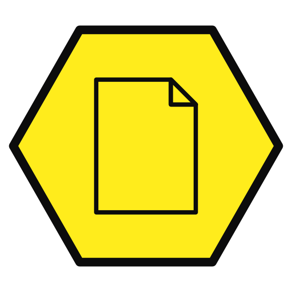
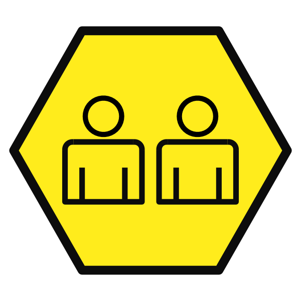

# The `{packageR}` game

`{packageR}` is a card game based on making a package for the R software language.

## About

[R](http://r-project.org) is a free software environment for statistical computing and graphics. Packages are how R developers share code and extend the software environment's core functionalities. A more comprehensive explanation of R packages is provided in the Introduction to Hadley Wickham and Jenny Bryan's [*R Packages* book](https://r-pkgs.org/introduction.html).

This game was developed as a toy to entertain [the other Matt](https://github.com/matt-dray/awesome-r-games).

It is designed for 2-4 players.

## Goal

Your goal as a player is to be the first to successfully build a package. To build a package you need to collect cards and eliminate errors.

You have successfully built a package when you have:

- one DESCRIPTION card
- one NAMESPACE card
- one LICENCE card
- three R script cards
- three documentation cards

R script cards can only be earned by exchanging a set of cards that have a combined value of 10 code units or more.

During the course of the game, players will acquire cards that have error values associated with them. For your package to build successfully you must either neutralise or remove errors from your package.

## Set-up

Each player starts with 2 R function cards (with a value of 1 code units each) and 1 minor error card.

The R script cards are placed in a separate pile. All remaining cards are shuffled and placed in the "build" pile.

## Game play

The player that last opened R is the first to go, play then continues in a clockwise fashion.

On their turn a player picks up three cards, they then perform any development actions dictated by their cards.

Some actions will require the player to discard cards. These should be placed in a separate pile to the build pile. When the build pile is exhausted the discard pile is shuffled and is used as the new build pile.

## Cards

The game deck is made up of 128 cards from 11 different types of card.

### DESCRIPTION

Every package requires a `DESCRIPTION` file that provides general metadata about your package such as its name, its purpose, the author(s), and dependencies.

**You must have a `DESCRIPTION` card in your package for it to build successfully.**

If you pick up extra `DESCRIPTION` cards discard them immediately.

### NAMESPACE

Alongside the `DESCRIPTION`, the `NAMESPACE` is an important metadata file. The `NAMESPACE` file tells R which functions from the package are made available to end users. It also includes which functions from other packages need to be loaded in order for you package to run.

**You must have a `NAMESPACE` card in your package for it to build successfully.**

If you pick up extra `NAMESPACE` cards discard them immediately.

### LICENSE

  

In order to share your package with others you must apply a `LICENSE`, which sets out the copyright provisions and the rights and responsibilities of other users, especially developers. Typically R code is licensed using either the MIT Licence or the GPLv3 Licence. If you are publishing a data package then you may want to use a public domain license such as CC0.

**You must have a `LICENSE` card in your package for it to build successfully.**

If you pick up extra `LICENSE` cards discard them immediately.

### Script

R scripts are where the code for the functions of your package are stored. Sometimes scripts contain a single function (`function.R`), a family of related functions (`family.R`), or they contain helpful utility/helper functions used by your main functions (`utils.R`).

Script cards are not included in the build pile, instead you must earn them by developing R functions. When you have cards totalling 10 or more units of code you can exchange them for an R script card.

**You must have 3 script cards in your package for it to build successfully.**

### Code

These cards represent the coding you do to create a package. Each card has either 1, 3 or 5 units of code associated with it. When you have cards totalling 10 or more units of code you can exchange them for an R script card.

When you exchange your code cards for an R script card the code cards are added to the discard pile.

### Error

  

When writing code you will inevitably encounter errors. In the `{packageR}` game there are three levels of error with an associated error value: a minor error (1), a major error (3), and a fatal error (5).

You must eliminate or neutralise errors in order for your package to build successfully. You can do this by collecting and using debug, test or collaborate cards.

#### Fatal error

When you pick up a fatal error card you must discard one of your code cards immediately. Until you remove the fatal error, on each subsequent turn you must continue to discard one of your code cards.

### Dependencies

 

Dependencies are other R packages that your package relies on. This can make development easier, so that you don't have to develop your own methods for example (such as charting or regression modelling). If another package is necessary for your package to run it is listed as one of the "imports". If another package provides features that are "nice to have" but are not essential then you can list them as one of the "suggests" packages.

Some of the imports cards have an added bonus, they permanently act as 1 unit of code. They are not discarded when you exchange code cards for R scripts.

Dependency management can be problematic though, the suggests cards have an error value of 1.

Every additional dependency card after your second dependency card adds 1 to error value in your package.

#### Fixing dependency errors
You solve dependency errors in the same way as solving the regular error cards, by using either the debug, test or collaborate cards. If you use a debug card you must discard the dependencies. If you use a test or collaborate card you can keep the dependencies in your package.

### Documentation

 

Documentation is essential to help end-users know how to use your package successfully. There are two types of documentation: function help and vignettes. Function help files explain how to use a specific function/set of functions, they outline the specific arguments, the returned value and specific guidance on usage. Vignettes are longer articles that describe things such as workflow or specific use cases.

**You must have 3 scdocumentation cards in your package for it to build successfully.**

### Debug

 

The main way you solve errors is through debugging. You can use the debug cards to remove errors from your package. They have a negative error value, showing you how much error each card can fix.

When you use a debug card to fix error(s) you must also discard the debug cards.

### Test

Another strategy for solving/protecting against error is to write test scripts. These are run as part of the development process to check that you have not introduced unexpected errors across your package. As with debug they have a negative error value, showing you how much error each card can fix.

Test scripts remain in your package, but can only be used once to debug errors from your package.

### Collaborate

Collaborating with others in package development can provide significant benefits. There are three types of collaboration code:

- collaborate on code: equivalent to 5 units of code
- collaborate on fixing: equivalent to fixing errors up to a value of 5
- collaborate on documentation: can be used in place of a documentation card.

## License

This work is licensed under <a href="http://creativecommons.org/licenses/by-sa/4.0/?ref=chooser-v1" target="_blank" rel="license noopener noreferrer" style="display:inline-block;">CC BY-SA 4.0</a>

